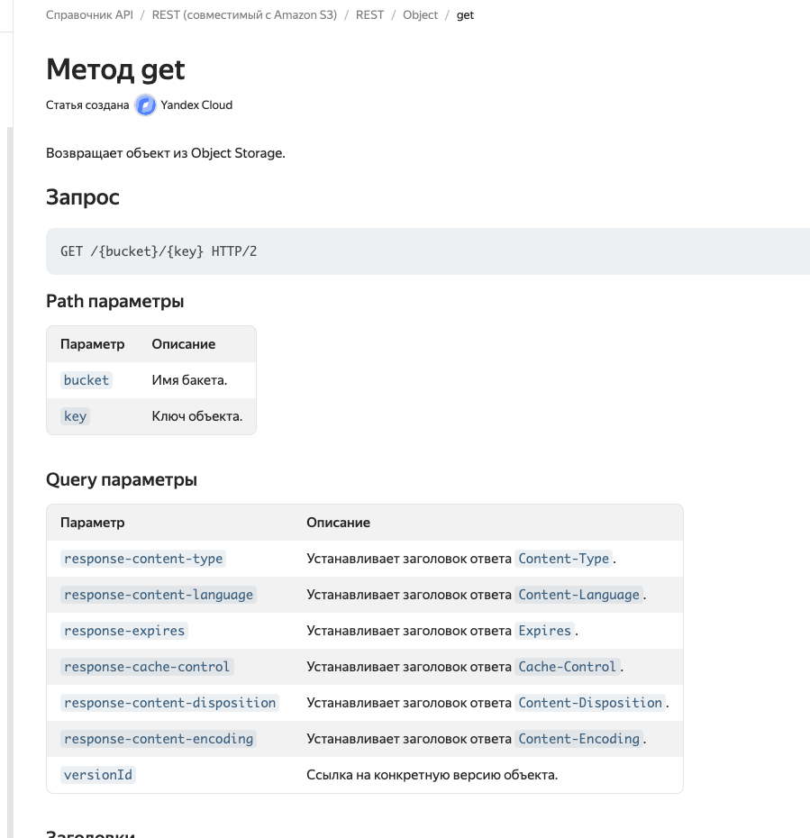

## Source of truth is: 
We have two source of truth due to concurrent write possibility into S3 Bucket 

For telegram chat it is S3TelegramStateBucket. only operator from chat with known single id can write there messages.
Messages only appends there to the end. That's how you cant lost any messages form Telegram

For Sitechat it is local state in browser memory. Only Sitechat can write there - appends messages to the end.

## Message sharing
Use shared S3 bucket which will be restored by client. Everyone cares only about their own messages.

## Cleanup strategy
Cleanup function do next when a cron triggers
- kill key if more then 1000 messages
- kill key if timeout 5 min reached
- mark ticked in telegram as closed
- all numbers could be adjusted

### Links
https://cloud.yandex.ru/docs/storage/s3/api-ref/object/get

support-bot-messages?key=test_from_stanislav-schema.json

https://storage.yandexcloud.net/support-bot-messages/test_from_stanislav-schema.json
